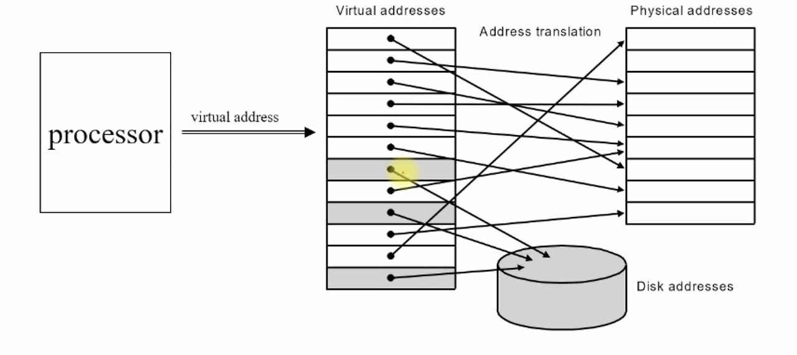

# 가상 메모리

가상 메모리는 컴퓸터 시스템에서 물리적인 메모리(실제 RAM) 외에 추가적인 메모리 공간을 제공하기 위해 사용하는 기술 운영 체제는
가상 메모리를 사용하여 실행 중인 프로그램들이 더 많은 메모리를 사용할 수 있도록 한다. 이느 주로 하드 디스크의 일부를 가상 메모리로 사용하여 이뤄진다.

## 가상 메모리의 장점

1. 메모리 확장: 물리적인 RAM이 부족할 때 가상 메모리를 사용하여 추가적인 메모리 공간을 제공한다. 이는 프로그램이 큰 데이터 세트를 처리하거나 여러 프로그램이 동시에 실행될 때 유용하다.

2. 메모리 보호: 각 프로세스는 독립된 가상 메모리 공간을 가지므로, 하나의 프로세스가 다른 프로세스의 메모리 영역을 침범하지 않도록 보호할 수 있다. 이는 시스템 안정성과 보안성을 높여준다.

3. 페이징 기법: 가상 메모리는 주로 페이징 기법을 사용하여 구현된다. 프로그램이 필요로 하는 메모리 페이지만을 실제로 물리 메모리에 로드하고, 나머지는 디스크에 저장된다. 필요할 때만
메모리에 페이지를 로드하므로 메모리 사용 효율이 높아진다.

4. 스왑 파일: 물리 메모리가 모두 사용될 경우, 사용하지 않는 메모리 페이지를 디스크의 스왑 파일로 이동시켜 물리 메모리 공간을 확보한다. 나중에 해당 페이지가 다시 필요할 때 디스크에서
메모리로 불러온다. 

